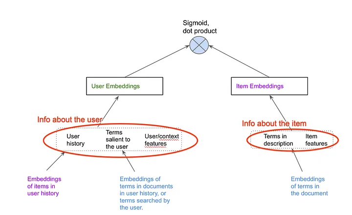

### Retrieval 알고리즘 고려사항
- 성능
- ANN이 가능한가
- cold start를 대처할 수 있는지
- context를 고려한 query를 만들 수 있는지
- 최대한 재학습 없이 임베딩을 업데이트 할 수 있는지

### two tower

- 출처: https://vinay-bhupalam.medium.com/personalized-recommendation-systems-c6a2159445b9

#### 장점
- 자유도가 높은 디자인, 다양한 임베딩 생성 가능
- 유저, 아이템 구조가 분리되어 있어서 서빙시 유저타워만 (온라인)추론에 사용된다.
  - request가 오면 그 때 계산가능 (context feature가 있을 시, 없으면 굳이 온라인추론할 필요없음)

#### 단점
- 아이템타워는 오프라인 추론만 가능하다.
  - 미리 아이템임베딩값을 계산해놓고 유저임베딩과 ANN 계산

### 예시
- [Sampling-Bias-Corrected Neural Modeling for Large Corpus Item Recommendations](https://research.google/pubs/pub48840/)

#### 특징
- in-batch negative
  - 모두 positive label을 사용한다. 즉, 해당 batch에 적어도 한번은 유저&아이템의 관계가 positive가 있다는 것이다.
  - 해당하는 batch에서 또 다른 유저, 아이템은 서로 negative관계일 것이다.
  - negative sampling을 하지 않고 batch 내에서 negative를 이용하는 것이다.
  - 장점은 데이터셋이 작아지지만 단점은 배치사이즈의 영향을 받고 실제 분포를 무시하는 결과가 발생한다.
    - 노출이 많이 되고 클릭된 것인지 아닌지 알 수 없음
- 그래서 sampling-bias correction을 했다고 한다.