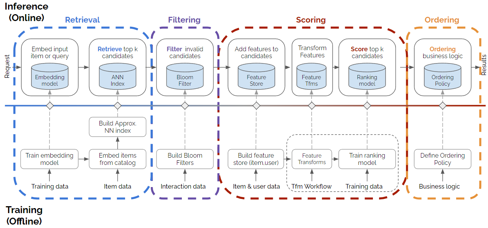
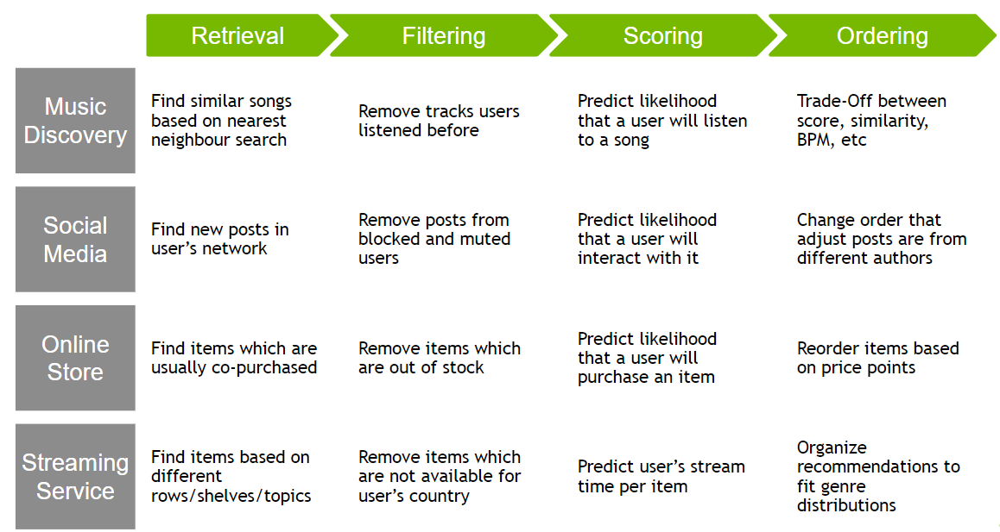

## multi stage 추천 시스템 단계

- 출처: https://medium.com/nvidia-merlin/recommender-systems-not-just-recommender-models-485c161c755e

### Retrieval
- 적은 feature를 사용하여 빠르게 계산할 수 있어야 한다.
- 예를 들어, 유저가 로그인하면 해당하는 유저 임베딩을 바로 구하고 미리 구해놓은 아이템 임베딩들과 ANN으로 가장 적절한 top k candidate를 찾는다.
- 임베딩을 만들 수 있는 알고리즘은 모두 사용가능 할 수 있다.

### Filtering
- 비지니스에 따라 노출시키고 싶지 않은 아이템을 추천에서 제외한다.
- 연령 제한, 재구매 방지, 품절 등등

### Scoring
- 더 느리지만 더 많은 feature와 정확한 모델을 통해 점수를 매긴다.
- 사용가능한 모델
  - classification 모델들 (클릭한다 안한다)
  - wide&deep 계열의 cross feature를 사용하는 deep learning 모델

### Ordering
- 모델 이외로 추천시스템 또는 비즈니스 목표를 함께 적용하여 최종 ranking을 만든다.
  - diversity, novelty, 마케팅 등등

## 예시
- 출처: https://medium.com/nvidia-merlin/recommender-systems-not-just-recommender-models-485c161c755e

- 더 궁금한 경우 인스타그램, pinterest, instacart 등 더 찾아보기
  - 하나의 stage에도 다양하고 여러개의 방법, 알고리즘을 적용
  - 마지막 ordering에는 diversity 등을 위해 휴리스틱한 방법도 많이 적용